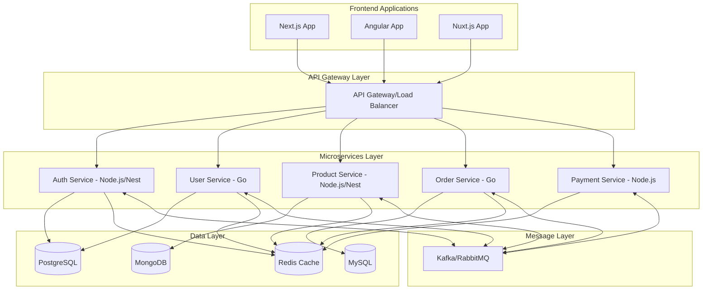

# 🚀 Microservices & Full-Stack Developer

<div align="center">
  
</div>

<div align="center">
  <a href="https://github.com/truong-ne">
    
  </a>
  <a href="https://linkedin.com/in/sejuly">
    
  </a>
  <a href="mailto:truonggolang@gmail.com">
    
  </a>
  <!-- <a href="https://yourportfolio.com">
    
  </a> -->
</div>

---

## 👨‍💻 About Me

I'm a passionate **Software Developer** specializing in **Microservices Architecture** with extensive experience in building scalable, distributed systems using modern technologies. I focus on creating robust backend services with **Node.js** and **Go**, while delivering exceptional user experiences through **Angular**, **Next.js**, and **Nuxt.js**.

```javascript
const developer = {
    name: "Le Dinh Truong",
    role: "Microservices & Software Developer",
    location: "Ho Chi Minh",
    architecture: ["Microservices", "Event-Driven", "Serverless", "Cloud-Native"],
    currentFocus: "Building scalable distributed systems with Node.js and Go",
    passion: "Creating efficient, maintainable, and scalable software solutions"
};
```

## 🛠️ Core Technology Stack

### Backend Development
<div align="left">
  
  
  
  
</div>

### Backend Frameworks
<div align="left">
  
  
  
  
  
</div>

### Frontend Frameworks
<div align="left">
  
  
  
  
  
</div>

### Databases & Data Storage
<div align="left">
  
  
  
  
  
</div>

### Microservices & Cloud Infrastructure
<div align="left">
  
  
  
  
  
</div>

### Message Brokers & Communication
<div align="left">
  
  
  
  
  
</div>

## 🎯 Technical Expertise

### Microservices Architecture
- **Service Design**: Designing loosely coupled, highly cohesive microservices following DDD principles
- **API Gateway**: Implementing API gateways with Kong, Zuul, and custom Node.js/Go solutions
- **Service Mesh**: Experience with Istio and Linkerd for service-to-service communication
- **Event-Driven Architecture**: Building event-driven systems using Kafka, RabbitMQ, and Redis Pub/Sub
- **Service Discovery**: Implementing service discovery with Consul, Eureka, and Kubernetes
- **Circuit Breakers**: Fault tolerance patterns with Hystrix and custom implementations

### Backend Development Excellence

#### Node.js Expertise
- **NestJS**: Building enterprise-grade applications with dependency injection, decorators, and modular architecture
- **Express/Fastify**: Creating high-performance REST APIs and GraphQL servers
- **Event Loop Optimization**: Deep understanding of Node.js internals and performance optimization
- **Stream Processing**: Implementing efficient data processing with Node.js streams
- **Worker Threads**: Utilizing worker threads for CPU-intensive operations

#### Go Expertise
- **Concurrency**: Mastering goroutines, channels, and concurrent patterns
- **Performance**: Building high-performance services with minimal memory footprint
- **gRPC Services**: Implementing efficient inter-service communication
- **CLI Tools**: Creating powerful command-line tools and utilities
- **System Programming**: Low-level system interactions and network programming

### Frontend Mastery

#### Angular Development
- **Component Architecture**: Building reusable, testable components
- **RxJS**: Reactive programming and complex state management
- **Performance Optimization**: Lazy loading, change detection strategies, and bundle optimization
- **Enterprise Applications**: Large-scale application architecture and module federation

#### Next.js & Nuxt.js
- **SSR/SSG**: Server-side rendering and static site generation strategies
- **Performance**: Core Web Vitals optimization and lighthouse score improvements
- **SEO Optimization**: Implementing best practices for search engine optimization
- **API Routes**: Building full-stack applications with integrated API endpoints

### Database Expertise
- **PostgreSQL**: Advanced queries, indexing, partitioning, and performance tuning
- **MySQL**: Replication, clustering, and query optimization
- **MongoDB**: Document modeling, aggregation pipelines, and sharding strategies
- **Redis**: Caching strategies, pub/sub, and data structures optimization
- **Database Patterns**: CQRS, Event Sourcing, and multi-database architectures

## 📊 Architecture & Design Patterns



## 🚀 Featured Projects & Achievements

### 1. 🏗️ E-Commerce Microservices Platform
**Tech Stack:** Node.js (NestJS), Go, PostgreSQL, MongoDB, Redis, Kafka, Next.js, Docker, Kubernetes

- Architected **30+ microservices** handling **5M+ daily requests**
- Implemented event-driven architecture reducing inter-service coupling by **80%**
- Achieved **99.99% uptime** with circuit breakers and fault tolerance
- Reduced API response time from **200ms to 30ms** through caching and optimization
- Built real-time inventory management with event sourcing

### 2. 🏦 Financial Services Platform
**Tech Stack:** Go, Node.js (NestJS), PostgreSQL, Redis, Angular, gRPC

- Developed high-performance transaction processing system handling **100K TPS**
- Implemented CQRS pattern for read/write optimization
- Built secure authentication service with JWT and OAuth 2.0
- Created real-time fraud detection system with **<10ms latency**
- Designed multi-tenant architecture supporting **1000+ clients**

### 3. 📱 Real-Time Collaboration Platform
**Tech Stack:** Node.js, MongoDB, Redis, WebSocket, Nuxt.js, Vue.js

- Built real-time collaboration features for **500K+ concurrent users**
- Implemented operational transformation for conflict-free editing
- Designed scalable WebSocket architecture with sticky sessions
- Created offline-first architecture with sync capabilities
- Reduced infrastructure costs by **60%** through optimization

### 4. 🎮 Gaming Backend Infrastructure
**Tech Stack:** Go, PostgreSQL, Redis, Docker, Kubernetes, Next.js

- Developed game server handling **1M+ concurrent players**
- Implemented matchmaking algorithm with **<2s wait time**
- Built leaderboard system with real-time updates
- Created anti-cheat system with ML-based detection
- Designed horizontally scalable architecture

## 📈 Performance Metrics & Optimizations

<div align="center">
  <table>
    <tr>
      <td align="center">
        <strong>⚡ API Performance</strong><br/>
        <code>&lt;30ms</code><br/>
        P99 Response Time
      </td>
      <td align="center">
        <strong>🚀 Throughput</strong><br/>
        <code>100K+ RPS</code><br/>
        Request Handling
      </td>
      <td align="center">
        <strong>📊 Database</strong><br/>
        <code>90%</code><br/>
        Query Optimization
      </td>
    </tr>
    <tr>
      <td align="center">
        <strong>🎯 Availability</strong><br/>
        <code>99.99%</code><br/>
        System Uptime
      </td>
      <td align="center">
        <strong>🔄 Deployment</strong><br/>
        <code>100+</code><br/>
        Daily Deployments
      </td>
      <td align="center">
        <strong>⚙️ Services</strong><br/>
        <code>50+</code><br/>
        Microservices Managed
      </td>
    </tr>
  </table>
</div>

## 🎓 Skills Matrix

### Expert Level
- **Languages**: Node.js, Go, TypeScript, JavaScript
- **Frameworks**: NestJS, Express, Angular, Next.js, Nuxt.js
- **Databases**: PostgreSQL, MySQL, MongoDB, Redis
- **Architecture**: Microservices, Event-Driven, CQRS, DDD
- **DevOps**: Docker, Kubernetes, CI/CD, GitOps

### Advanced Level
- **Cloud**: AWS, GCP, Azure
- **Monitoring**: Prometheus, Grafana, ELK Stack
- **Testing**: Unit, Integration, E2E, Load Testing
- **Security**: OAuth, JWT, API Security, OWASP

### Tools & Technologies
- **Version Control**: Git, GitHub, GitLab
- **CI/CD**: GitHub Actions, Jenkins, GitLab CI
- **Monitoring**: DataDog, New Relic, Sentry
- **Documentation**: OpenAPI, AsyncAPI, Postman

## 🏆 Certifications & Achievements

- **AWS Certified Solutions Architect**
- **Google Cloud Professional Cloud Architect**
- **Kubernetes Certified Application Developer (CKAD)**
- **MongoDB Certified Developer**
- **Contributing to open-source projects** with 1000+ stars

## 📚 Current Focus & Learning

- 🔮 **Service Mesh**: Deep diving into Istio and Linkerd
- 🧠 **AI/ML Integration**: Incorporating ML models into microservices
- 🦀 **Rust**: Exploring system programming for performance-critical services
- 📊 **Observability**: Advanced distributed tracing and monitoring
- 🔐 **Zero-Trust Architecture**: Implementing security at every layer

---

<div align="center">
  
  
</div>

<div align="center">
  
</div>

---

<div align="center">
  <i>Building distributed systems, one service at a time</i>
  <br/>
  
</div>